# Java Spring FrameWork REST API Team Project(2021.02.05 ~ 2021.02.18) URS REST

## 1.프로젝트 개요

>1. 해당 프로젝트는 Spring FrameWork의 기초 이해 및 EJS를 이용하여 Front를 구현한 웹 서버와 통신하는 앱 클라이언트 프로젝트이다. 
>2. 기존의 웹 서버와 통신하기위한 Spring WebSocket 모듈을 이용하였고, REST Controller를 이용하여 JSON 데이터를 클라이언트에게 전달한다. 
>3. 클라이언트 앱 구현은 Android Studio를 이용하였고, Intent, ViewPager 및 Fragment를 이용하여 화면 전환 이벤트를 구현하였다. 

## 2. 프로젝트 자원

>+ 인력 : 2인
>+ 기간 : 약 2주(평일 09-18시 이후)
>+ SW Server : Oracle 11g XE, JDK 1.8, Lombok, SMTP, Spring FrameWork, Jackson Json, Tomcat 8.5 
>+ SW Client : Android Studio, Gson, Lottie, Glide, Biometric(지문인식)
>+ 기타 정적 자원 : Free PNG Format Image & 직접 디자인, Free Font, Free Front Template

## 3. 프로젝트 수행흐름

>1. 필수 기능 정리 및 화면 설계
>2. 역할별 업무 분담
>3. 역할별 업무 수행
>><ol> 3.1 디자인 및 필요 자원 수집(Image, Icon) </ol>
>><ol> 3.2 환경 설정(Package 분리, Dependencies 설정, Permission 설정) [본인] </ol>
>><ol> 3.3 기능 구현(화면[일반사용자], CRUD, 페이지 전환, BootPay API 등) [본인 - 사용자 화면 일부, RestController 일부, Glide] </ol>

## 4. 프로젝트 시나리오

>+ 앱 사용자는 **예약자**로 한정한다.
>+ 웹 페이지에서 사용하던 기본 기능들을 앱으로 구현한다.

## 5. 사용자 유형별 기능

>1. 예약자
>>+ 등록된 점포 리스트 및 메뉴 리스트 조회, 잔여 좌석 조회, 결제 후 결제 목록 조회
 
## 6. 프로젝트 결과 (Android Studio Emulator)
>### 메인 화면

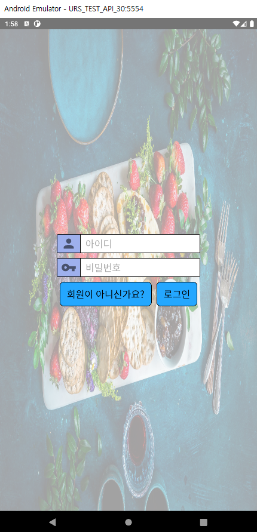

>### 회원가입

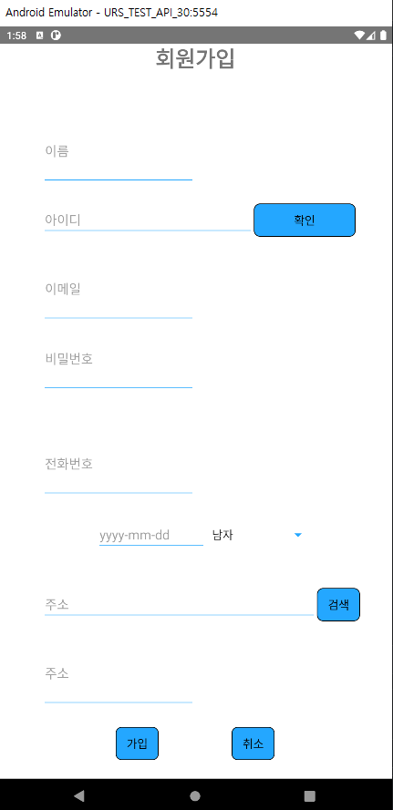

>### 예약자 화면

>> ### 예약자 로그인 후 메인화면 및 버튼구성
>>> 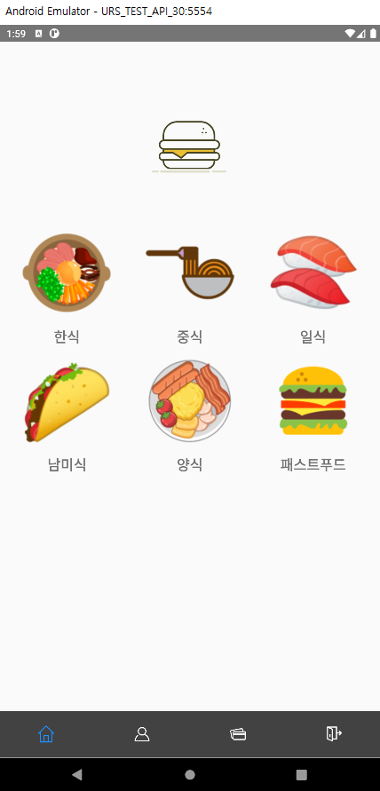

>>> 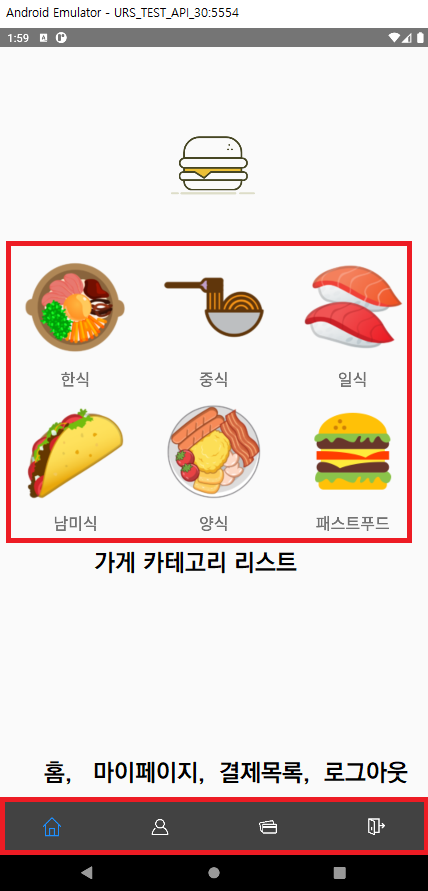

>> ### 마이페이지
>>> 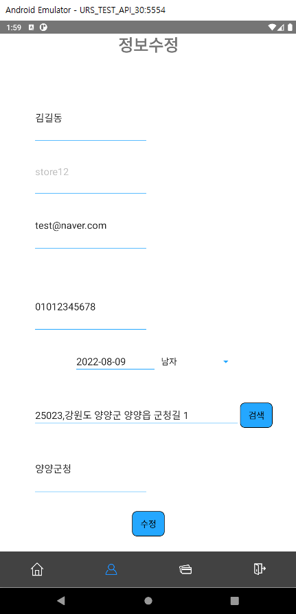

>> ### 결제목록
>>> 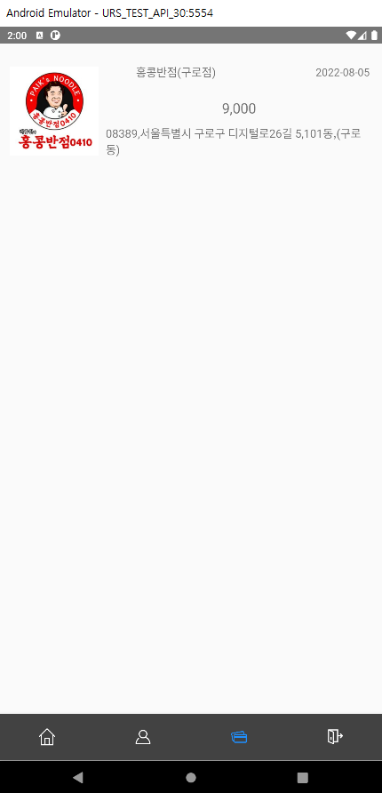

>> ### 가게 카테고리 클릭 후, 가게 리스트 조회
>>> 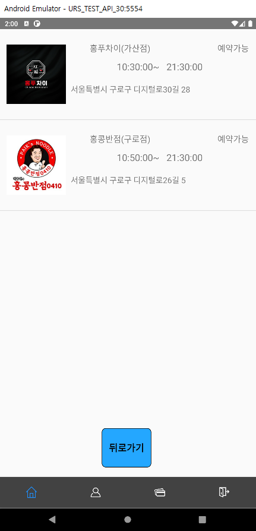

>> ### 가게 클릭 후, 메뉴 리스트 조회
>>> 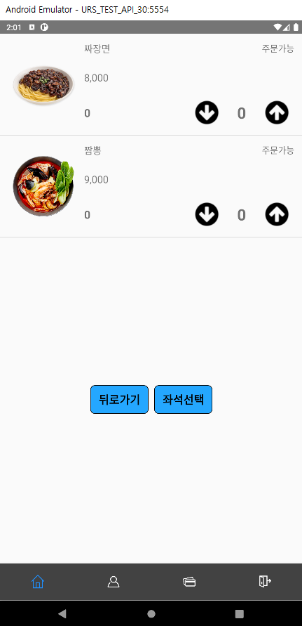

>> ### 메뉴 선택 후, 좌석 선택
>>> 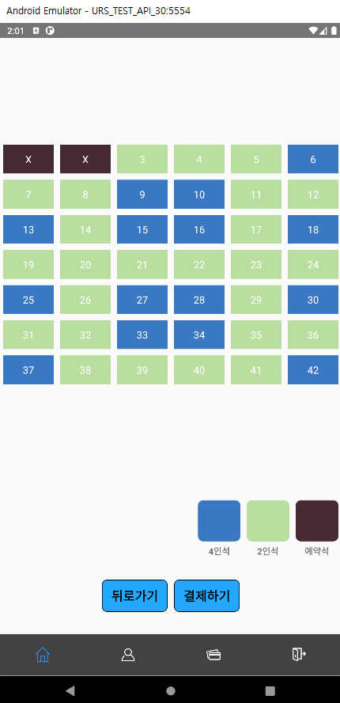

>> ### 좌석 선택 후, 결제하기 
>>> 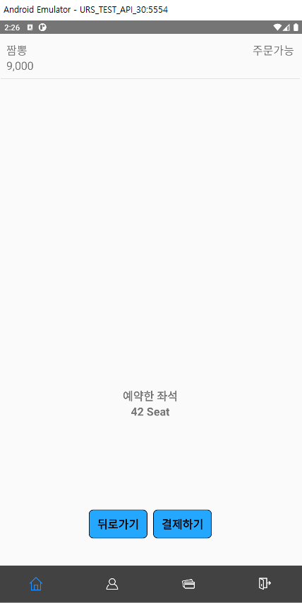

>> ### 결제하기 BootPay 
>>> 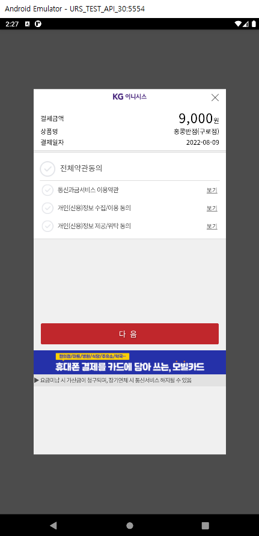

>> ### 결제 후, 결제목록 조회
>>> 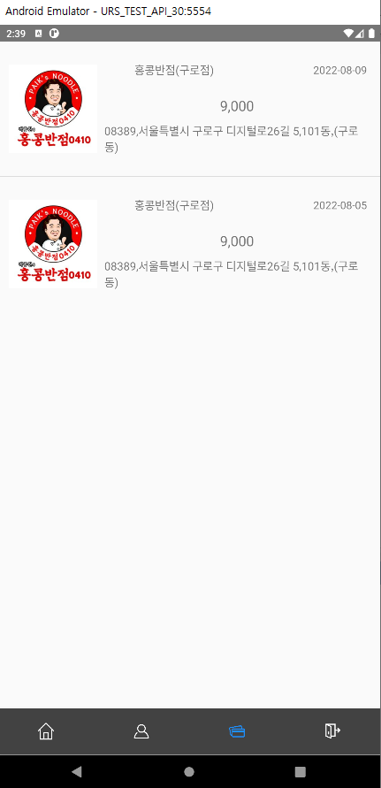

>> ### 결제 후, 좌석 조회
>>> 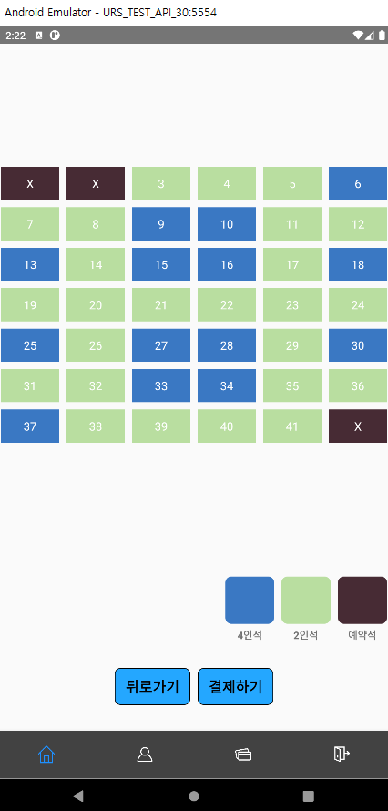

>> ### 결제 후, 웹 에서 좌석 조회
>>> 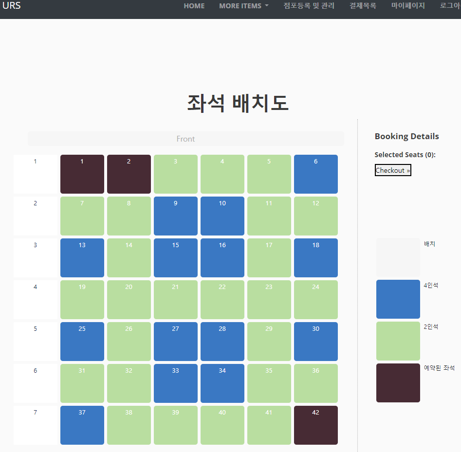

